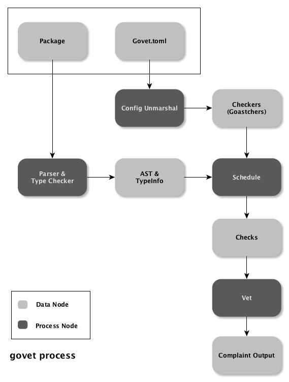

# Configurable Govet

**ALPHA VERSION**

usually, there is a good choice that is `go tool vet`, `golint` or any more. But:

+ Cannot to select specific checks for subpackages or subfiles.
+ Cannot to add special (not provided by the tool) checks.
+ Check with toolset is slowly, like [gometalinter](https://github.com/alecthomas/gometalinter)
+ Not better engineering support.

so, it was coded.

## Usage

Run `go run main.go check` to experience.

1. config `govet.yaml`
2. run `govet check`

```shell
$ govet -h
Usage:
  govet [command]

Available Commands:
  check       Run check on the project
  help        Help about any command

Flags:
      --choke int   maximum number of complaining message (default 30)
  -h, --help        help for govet

Use "govet [command] --help" for more information about a command.
```

## Govet.yaml

main config fileds:

| field | type | default | meaning |
| --- | ---  | --- | --- |
| choke | integer | 20 | choked abort line number |
| ignored | string array | nil | ignored sub packages or files |
| enabled | string array | all checkers | enabled checkers |
| disabled | string array | nil | disabled checkers |
| override | object array | nil | overrided config of sub packages or files |
| checker | object array | nil | checkers define |

*override* config fileds:

| field | type | default | meaning |
| --- | --- | --- | --- |
| package | string | nil | sub package of overrided |
| file | string | nil | sub file
| enabled | string array | all checkers | enabled checkers |
| disabled | string array | nil | disabled checkers |

checker config fileds:

| field | type | meaning |
| --- | --- | --- |
| name | string | name of checker |
| goastch | string | go ast matcher |
| message | string | abort message |

## Implement



1. `Package`: all packages of current project
2. `Govet.toml`: govet config file
3. `Config Unmarshal`: config parser
4. `Parser & Type Checker`: go parser & type checker
5. `Schedule`: schedule checkers
6. `Checks`: checkers and checked packages/files
7. `Vet`: run checkers and complaint
8. `Complaint Output`: complaint messages
